# DocSync Backend API Flow Diagrams

This document contains a request flow diagram for every HTTP endpoint in the backend. Each diagram shows the middleware chain, the decision branches, the data or service calls, and the response codes that the handler can return.

Source of truth: `backend/src/app.js` and the route files in `backend/src/routes/`. Middleware behavior is taken from `backend/src/middleware/`.

## Legend

- Rounded nodes are request start points and final responses.
- Diamonds are decisions. Labels on edges show the branch condition.
- Failure nodes are error responses. The HTTP status code is in the node text.
- Billing operations are forwarded to the external billing service. The billing service is not in this workspace.

## 1. Common Request Pipeline

Most protected endpoints run this chain in order. Individual sections below show only the steps that are specific to that endpoint.

Routes that use only `requireAuth` skip the organization context and permission steps.

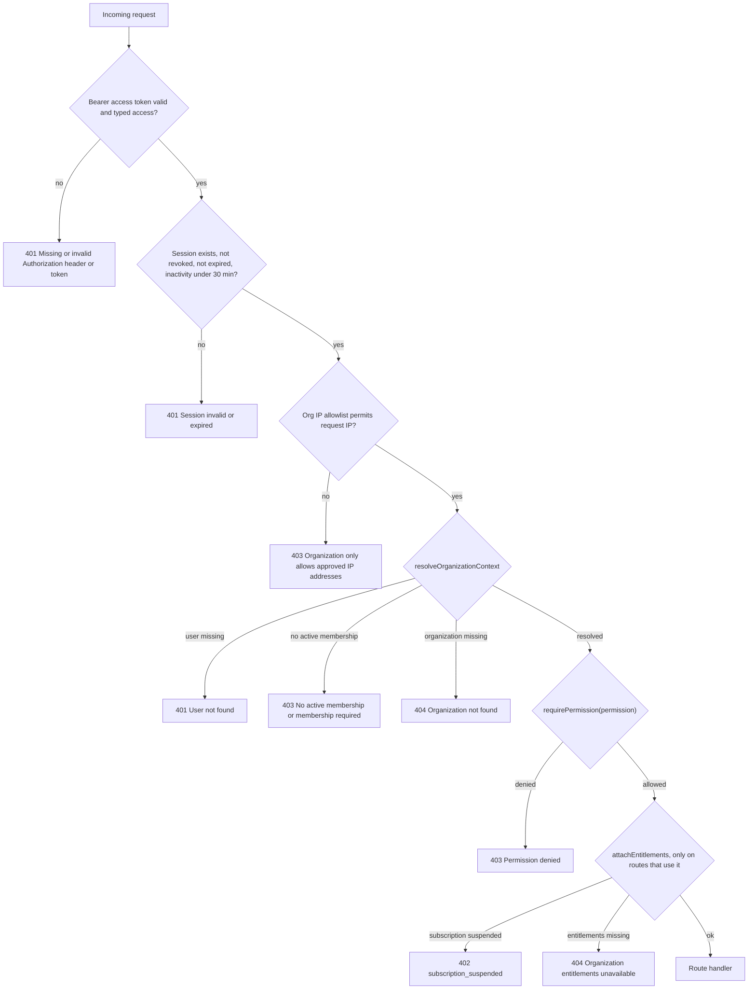
```mermaid
flowchart TD
  R["Incoming request"] --> A{"Bearer access token valid and typed access?"}
  A -->|no| A1["401 Missing or invalid Authorization header or token"]
  A -->|yes| S{"Session exists, not revoked, not expired, inactivity under 30 min?"}
  S -->|no| S1["401 Session invalid or expired"]
  S -->|yes| IP{"Org IP allowlist permits request IP?"}
  IP -->|no| IP1["403 Organization only allows approved IP addresses"]
  IP -->|yes| OC{"resolveOrganizationContext"}
  OC -->|user missing| OC1["401 User not found"]
  OC -->|no active membership| OC2["403 No active membership or membership required"]
  OC -->|organization missing| OC3["404 Organization not found"]
  OC -->|resolved| P{"requirePermission(permission)"}
  P -->|denied| P1["403 Permission denied"]
  P -->|allowed| E{"attachEntitlements, only on routes that use it"}
  E -->|subscription suspended| E1["402 subscription_suspended"]
  E -->|entitlements missing| E2["404 Organization entitlements unavailable"]
  E -->|ok| H["Route handler"]
```

Permission rules (`backend/src/middleware/rbac/index.js`):

- Owner-only permissions: `organization.member.invite`, `organization.member.manage`, `organization.invite.read`.
- `organization.billing.manage` is allowed for the owner and for members with `billingAdmin` set.
- All other permissions come from the `MEMBER_PERMISSIONS` set.

Quota and feature checks (`backend/src/store/index.js`) run inside handlers or in dedicated middleware, not in `attachEntitlements`.

---

## 2. Auth Endpoints (`/api/auth`)

Source: `backend/src/routes/auth.routes.js`, mounted at `/api/auth`. Endpoints from `security.routes.js` are also mounted under `/api/auth` and are covered in sections 2.7 to 2.13. Endpoints from `sessions.routes.js` are covered in section 3.

### 2.1 POST /api/auth/register

Creates a user account. Rate limited by `registerRateLimit`.

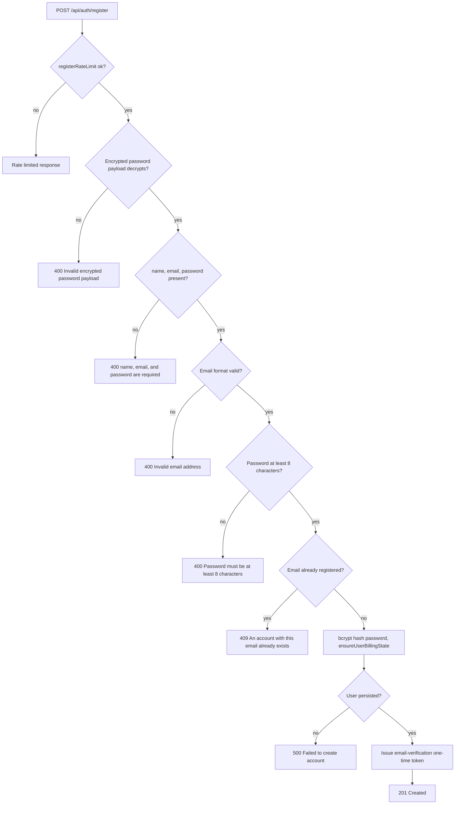
```mermaid
flowchart TD
  A["POST /api/auth/register"] --> B{"registerRateLimit ok?"}
  B -->|no| B1["Rate limited response"]
  B -->|yes| C{"Encrypted password payload decrypts?"}
  C -->|no| C1["400 Invalid encrypted password payload"]
  C -->|yes| D{"name, email, password present?"}
  D -->|no| D1["400 name, email, and password are required"]
  D -->|yes| E{"Email format valid?"}
  E -->|no| E1["400 Invalid email address"]
  E -->|yes| F{"Password at least 8 characters?"}
  F -->|no| F1["400 Password must be at least 8 characters"]
  F -->|yes| G{"Email already registered?"}
  G -->|yes| G1["409 An account with this email already exists"]
  G -->|no| H["bcrypt hash password, ensureUserBillingState"]
  H --> I{"User persisted?"}
  I -->|no| I1["500 Failed to create account"]
  I -->|yes| J["Issue email-verification one-time token"]
  J --> K["201 Created"]
```

### 2.2 POST /api/auth/login

Password login. Rate limited by `loginRateLimit`. Returns either a session or a 2FA temporary token.

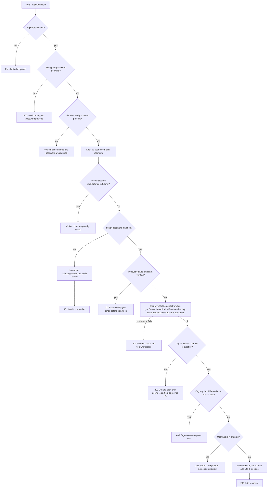
```mermaid
flowchart TD
  A["POST /api/auth/login"] --> B{"loginRateLimit ok?"}
  B -->|no| B1["Rate limited response"]
  B -->|yes| C{"Encrypted password decrypts?"}
  C -->|no| C1["400 Invalid encrypted password payload"]
  C -->|yes| D{"Identifier and password present?"}
  D -->|no| D1["400 email/username and password are required"]
  D -->|yes| E["Look up user by email or username"]
  E --> F{"Account locked (lockoutUntil in future)?"}
  F -->|yes| F1["423 Account temporarily locked"]
  F -->|no| G{"bcrypt password matches?"}
  G -->|no| G1["Increment failedLoginAttempts, audit failure"]
  G1 --> G2["401 Invalid credentials"]
  G -->|yes| H{"Production and email not verified?"}
  H -->|yes| H1["403 Please verify your email before signing in"]
  H -->|no| I["ensureTenantBootstrapForUser, syncCurrentOrganizationFromMembership, ensureWorkspaceForUserProvisioned"]
  I -->|provisioning fails| I1["500 Failed to provision your workspace"]
  I -->|ok| J{"Org IP allowlist permits request IP?"}
  J -->|no| J1["403 Organization only allows login from approved IPs"]
  J -->|yes| K{"Org requires MFA and user has no 2FA?"}
  K -->|yes| K1["403 Organization requires MFA"]
  K -->|no| L{"User has 2FA enabled?"}
  L -->|yes| L1["202 Returns tempToken, no session created"]
  L -->|no| M["createSession, set refresh and CSRF cookies"]
  M --> N["200 Auth response"]
```

### 2.3 POST /api/auth/verify-email

Consumes an email verification token.

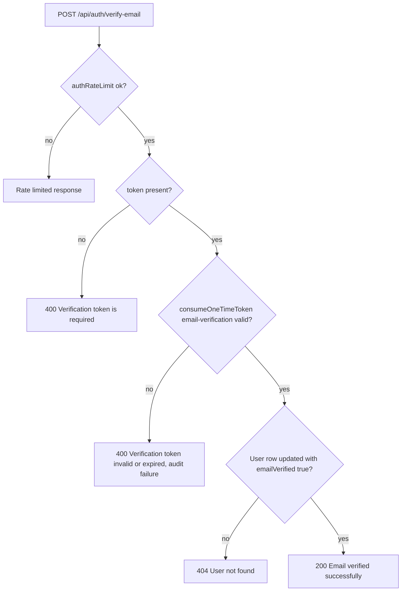
```mermaid
flowchart TD
  A["POST /api/auth/verify-email"] --> B{"authRateLimit ok?"}
  B -->|no| B1["Rate limited response"]
  B -->|yes| C{"token present?"}
  C -->|no| C1["400 Verification token is required"]
  C -->|yes| D{"consumeOneTimeToken email-verification valid?"}
  D -->|no| D1["400 Verification token invalid or expired, audit failure"]
  D -->|yes| E{"User row updated with emailVerified true?"}
  E -->|no| E1["404 User not found"]
  E -->|yes| F["200 Email verified successfully"]
```

### 2.4 POST /api/auth/resend-verification

Issues a new verification token for an unverified account.

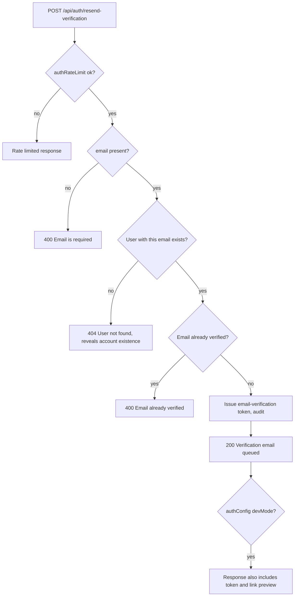
```mermaid
flowchart TD
  A["POST /api/auth/resend-verification"] --> B{"authRateLimit ok?"}
  B -->|no| B1["Rate limited response"]
  B -->|yes| C{"email present?"}
  C -->|no| C1["400 Email is required"]
  C -->|yes| D{"User with this email exists?"}
  D -->|no| D1["404 User not found, reveals account existence"]
  D -->|yes| E{"Email already verified?"}
  E -->|yes| E1["400 Email already verified"]
  E -->|no| F["Issue email-verification token, audit"]
  F --> G["200 Verification email queued"]
  G --> H{"authConfig devMode?"}
  H -->|yes| H1["Response also includes token and link preview"]
```

### 2.5 POST /api/auth/forgot-password

Starts a password reset. Always returns the same message to avoid revealing which emails exist.

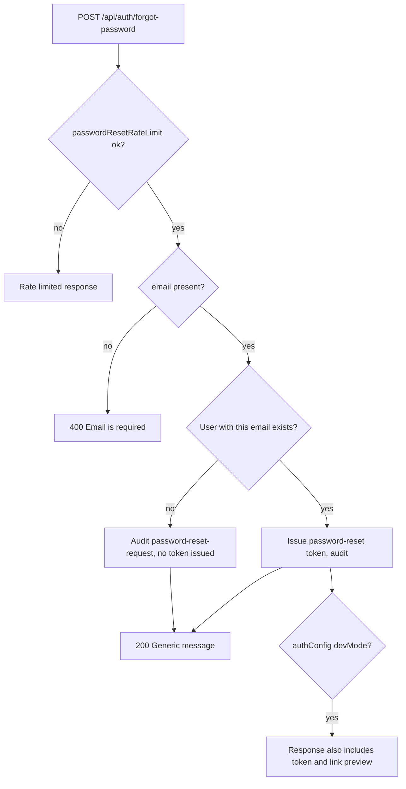
```mermaid
flowchart TD
  A["POST /api/auth/forgot-password"] --> B{"passwordResetRateLimit ok?"}
  B -->|no| B1["Rate limited response"]
  B -->|yes| C{"email present?"}
  C -->|no| C1["400 Email is required"]
  C -->|yes| D{"User with this email exists?"}
  D -->|no| E["Audit password-reset-request, no token issued"]
  D -->|yes| F["Issue password-reset token, audit"]
  E --> G["200 Generic message"]
  F --> G
  F --> H{"authConfig devMode?"}
  H -->|yes| H1["Response also includes token and link preview"]
```

### 2.6 POST /api/auth/reset-password

Sets a new password using a reset token. Revokes all sessions for the user.

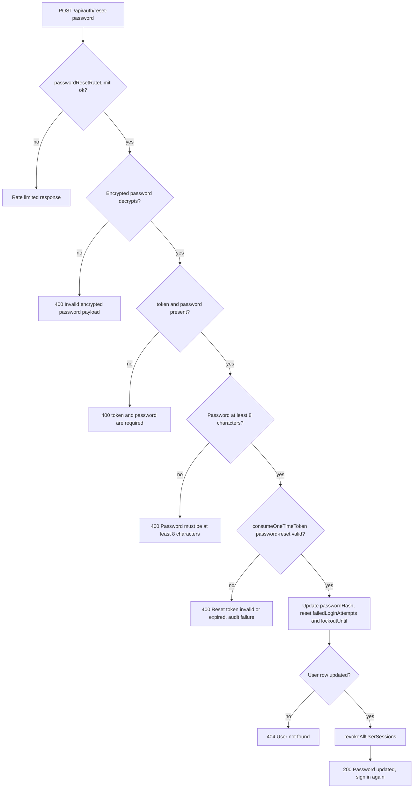
```mermaid
flowchart TD
  A["POST /api/auth/reset-password"] --> B{"passwordResetRateLimit ok?"}
  B -->|no| B1["Rate limited response"]
  B -->|yes| C{"Encrypted password decrypts?"}
  C -->|no| C1["400 Invalid encrypted password payload"]
  C -->|yes| D{"token and password present?"}
  D -->|no| D1["400 token and password are required"]
  D -->|yes| E{"Password at least 8 characters?"}
  E -->|no| E1["400 Password must be at least 8 characters"]
  E -->|yes| F{"consumeOneTimeToken password-reset valid?"}
  F -->|no| F1["400 Reset token invalid or expired, audit failure"]
  F -->|yes| G["Update passwordHash, reset failedLoginAttempts and lockoutUntil"]
  G --> H{"User row updated?"}
  H -->|no| H1["404 User not found"]
  H -->|yes| I["revokeAllUserSessions"]
  I --> J["200 Password updated, sign in again"]
```

### 2.7 POST /api/auth/login/2fa and POST /api/security/login/2fa

Second step of login when 2FA is enabled. Source: `security.routes.js`. Reachable at both mounts.

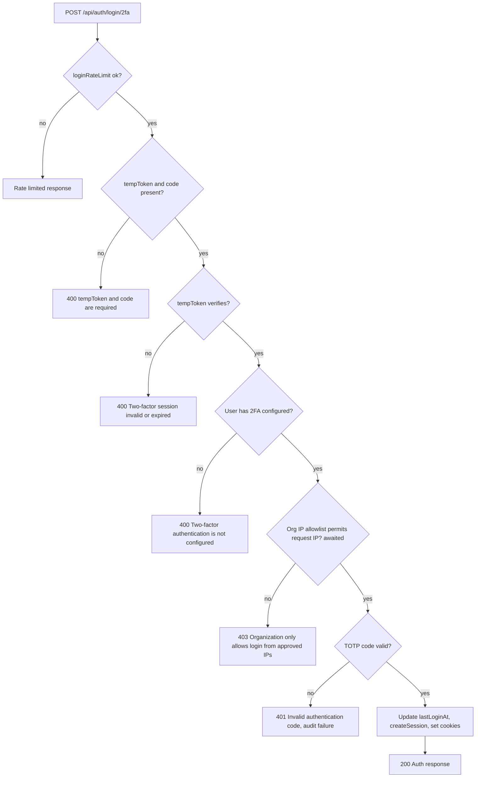
```mermaid
flowchart TD
  A["POST /api/auth/login/2fa"] --> B{"loginRateLimit ok?"}
  B -->|no| B1["Rate limited response"]
  B -->|yes| C{"tempToken and code present?"}
  C -->|no| C1["400 tempToken and code are required"]
  C -->|yes| D{"tempToken verifies?"}
  D -->|no| D1["400 Two-factor session invalid or expired"]
  D -->|yes| E{"User has 2FA configured?"}
  E -->|no| E1["400 Two-factor authentication is not configured"]
  E -->|yes| F{"Org IP allowlist permits request IP? awaited"}
  F -->|no| F1["403 Organization only allows login from approved IPs"]
  F -->|yes| G{"TOTP code valid?"}
  G -->|no| G1["401 Invalid authentication code, audit failure"]
  G -->|yes| H["Update lastLoginAt, createSession, set cookies"]
  H --> I["200 Auth response"]
```

### 2.8 GET /api/auth/public-key and GET /api/security/public-key

Returns the public key that clients use to encrypt passwords. Rate limited by `authRateLimit`.

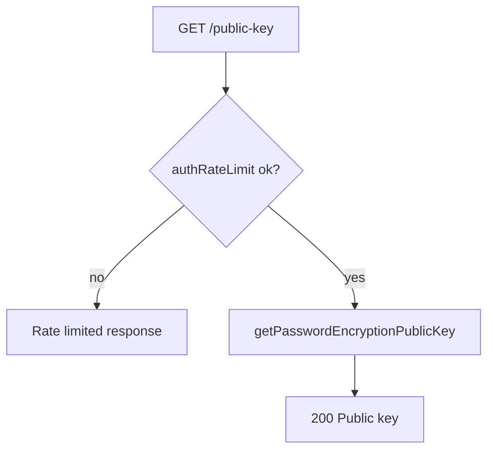
```mermaid
flowchart TD
  A["GET /public-key"] --> B{"authRateLimit ok?"}
  B -->|no| B1["Rate limited response"]
  B -->|yes| C["getPasswordEncryptionPublicKey"]
  C --> D["200 Public key"]
```

### 2.9 GET /api/auth/audit-logs and GET /api/security/audit-logs

Lists the caller's own audit entries.

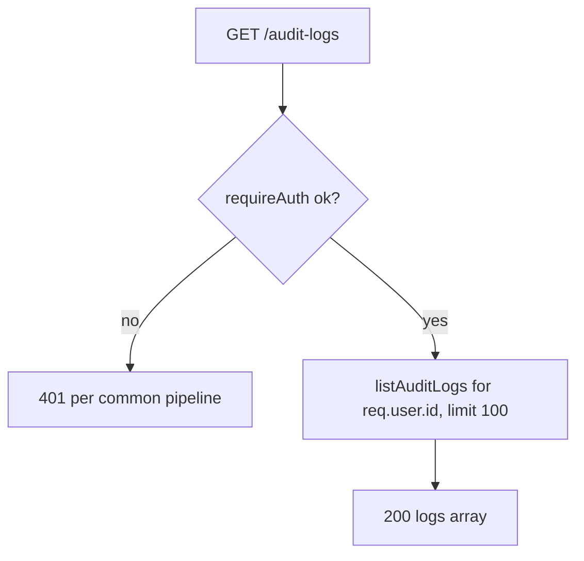
```mermaid
flowchart TD
  A["GET /audit-logs"] --> B{"requireAuth ok?"}
  B -->|no| B1["401 per common pipeline"]
  B -->|yes| C["listAuditLogs for req.user.id, limit 100"]
  C --> D["200 logs array"]
```

### 2.10 GET /api/auth/security and GET /api/security/security

Returns the caller's profile and active session count.

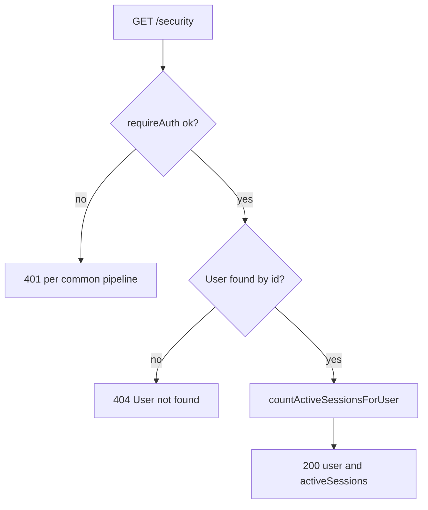
```mermaid
flowchart TD
  A["GET /security"] --> B{"requireAuth ok?"}
  B -->|no| B1["401 per common pipeline"]
  B -->|yes| C{"User found by id?"}
  C -->|no| C1["404 User not found"]
  C -->|yes| D["countActiveSessionsForUser"]
  D --> E["200 user and activeSessions"]
```

### 2.11 POST /api/auth/2fa/setup

Creates a temporary TOTP secret and returns an otpauth URI and QR code.

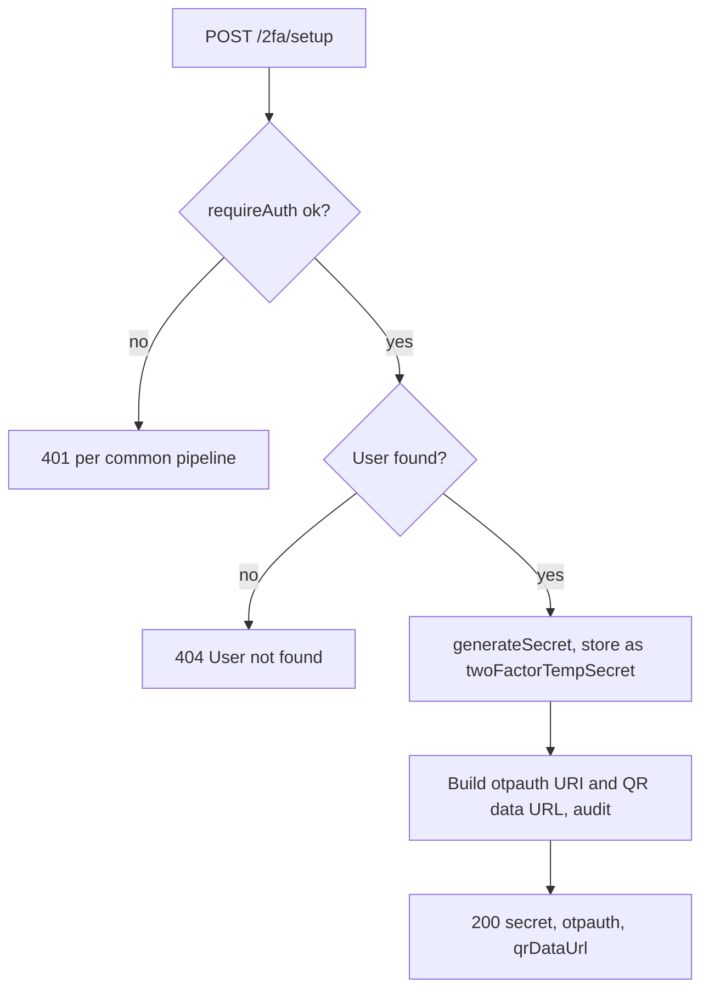
```mermaid
flowchart TD
  A["POST /2fa/setup"] --> B{"requireAuth ok?"}
  B -->|no| B1["401 per common pipeline"]
  B -->|yes| C{"User found?"}
  C -->|no| C1["404 User not found"]
  C -->|yes| D["generateSecret, store as twoFactorTempSecret"]
  D --> E["Build otpauth URI and QR data URL, audit"]
  E --> F["200 secret, otpauth, qrDataUrl"]
```

### 2.12 POST /api/auth/2fa/enable

Confirms the temporary secret with a code and enables 2FA.

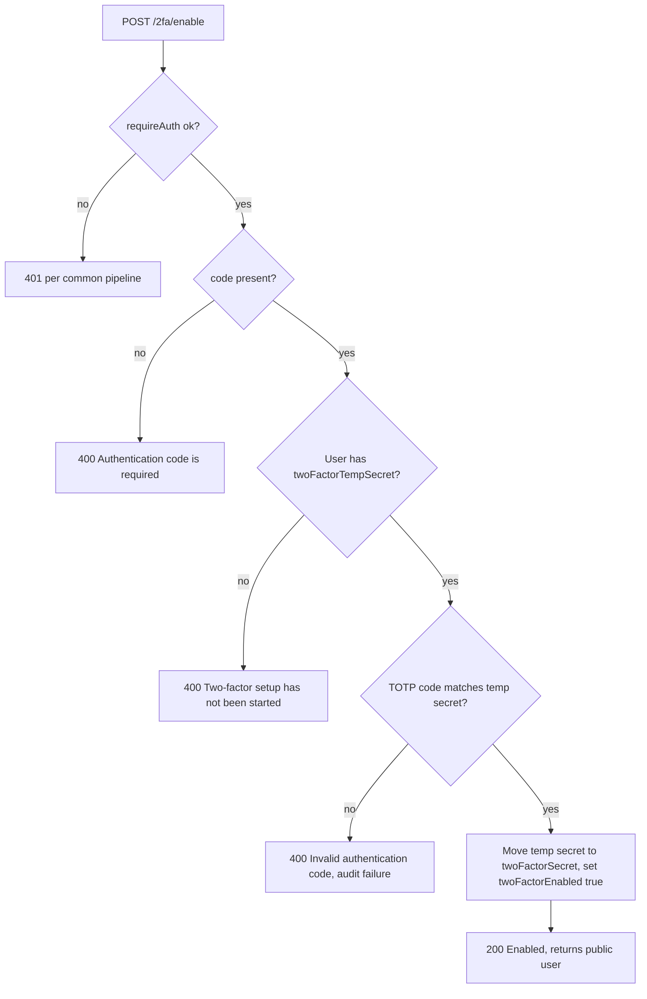
```mermaid
flowchart TD
  A["POST /2fa/enable"] --> B{"requireAuth ok?"}
  B -->|no| B1["401 per common pipeline"]
  B -->|yes| C{"code present?"}
  C -->|no| C1["400 Authentication code is required"]
  C -->|yes| D{"User has twoFactorTempSecret?"}
  D -->|no| D1["400 Two-factor setup has not been started"]
  D -->|yes| E{"TOTP code matches temp secret?"}
  E -->|no| E1["400 Invalid authentication code, audit failure"]
  E -->|yes| F["Move temp secret to twoFactorSecret, set twoFactorEnabled true"]
  F --> G["200 Enabled, returns public user"]
```

### 2.13 POST /api/auth/2fa/disable

Disables 2FA after verifying a current code.

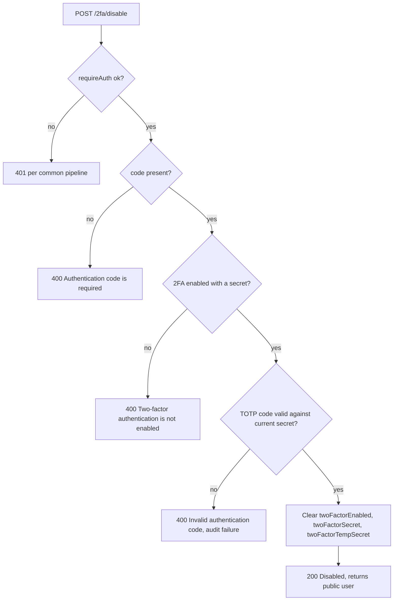
```mermaid
flowchart TD
  A["POST /2fa/disable"] --> B{"requireAuth ok?"}
  B -->|no| B1["401 per common pipeline"]
  B -->|yes| C{"code present?"}
  C -->|no| C1["400 Authentication code is required"]
  C -->|yes| D{"2FA enabled with a secret?"}
  D -->|no| D1["400 Two-factor authentication is not enabled"]
  D -->|yes| E{"TOTP code valid against current secret?"}
  E -->|no| E1["400 Invalid authentication code, audit failure"]
  E -->|yes| F["Clear twoFactorEnabled, twoFactorSecret, twoFactorTempSecret"]
  F --> G["200 Disabled, returns public user"]
```

---

## 3. Session Endpoints (`/api/sessions` and `/api/auth`)

Source: `backend/src/routes/sessions.routes.js`. Mounted at `/api/sessions` and again at `/api/auth`, so every endpoint below exists at both prefixes.

### 3.1 POST /api/sessions/refresh (also /api/auth/refresh)

Rotates the refresh session using the cookie and CSRF token. Rate limited by `authRateLimit`.

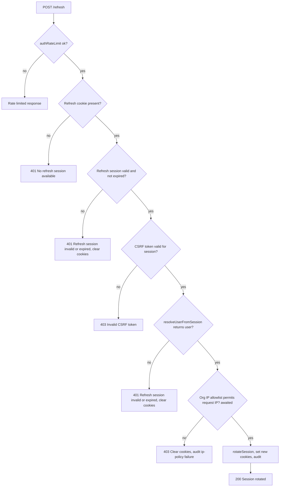
```mermaid
flowchart TD
  A["POST /refresh"] --> B{"authRateLimit ok?"}
  B -->|no| B1["Rate limited response"]
  B -->|yes| C{"Refresh cookie present?"}
  C -->|no| C1["401 No refresh session available"]
  C -->|yes| D{"Refresh session valid and not expired?"}
  D -->|no| D1["401 Refresh session invalid or expired, clear cookies"]
  D -->|yes| E{"CSRF token valid for session?"}
  E -->|no| E1["403 Invalid CSRF token"]
  E -->|yes| F{"resolveUserFromSession returns user?"}
  F -->|no| F1["401 Refresh session invalid or expired, clear cookies"]
  F -->|yes| G{"Org IP allowlist permits request IP? awaited"}
  G -->|no| G1["403 Clear cookies, audit ip-policy failure"]
  G -->|yes| H["rotateSession, set new cookies, audit"]
  H --> I["200 Session rotated"]
```

### 3.2 POST /api/sessions/logout

Revokes the current session and clears cookies.

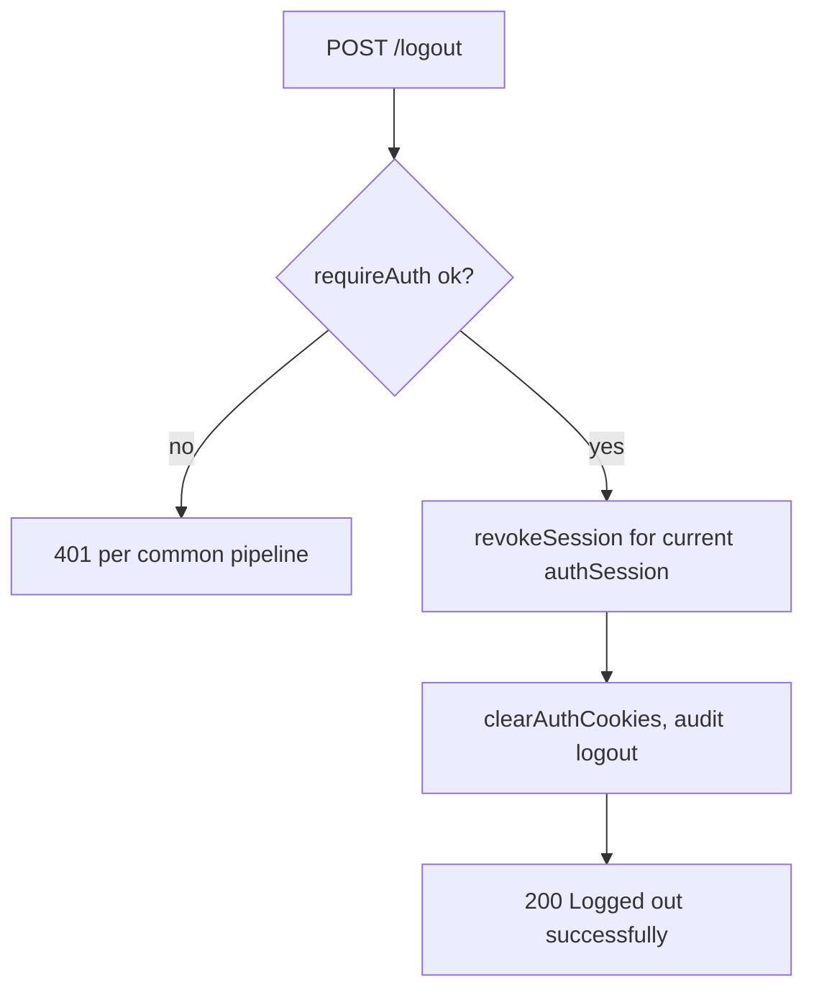
```mermaid
flowchart TD
  A["POST /logout"] --> B{"requireAuth ok?"}
  B -->|no| B1["401 per common pipeline"]
  B -->|yes| C["revokeSession for current authSession"]
  C --> D["clearAuthCookies, audit logout"]
  D --> E["200 Logged out successfully"]
```

### 3.3 GET /api/sessions/me

Returns the current user, session, and CSRF token.

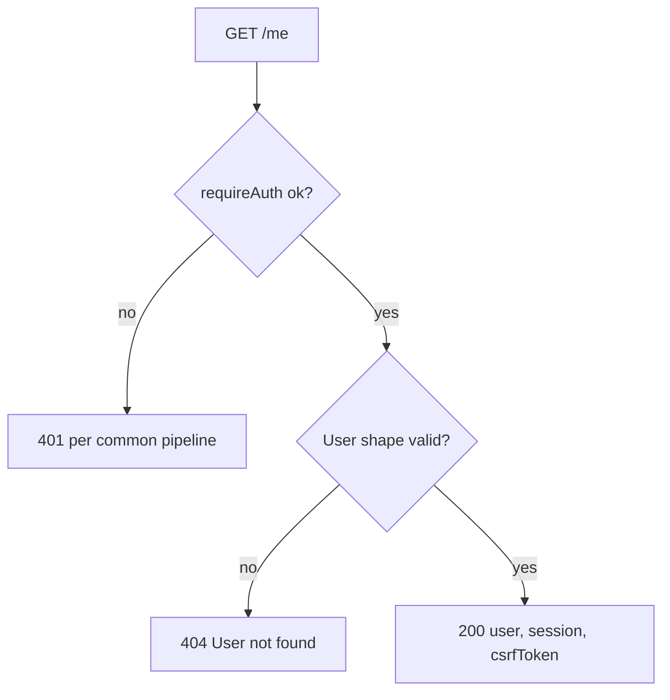
```mermaid
flowchart TD
  A["GET /me"] --> B{"requireAuth ok?"}
  B -->|no| B1["401 per common pipeline"]
  B -->|yes| C{"User shape valid?"}
  C -->|no| C1["404 User not found"]
  C -->|yes| D["200 user, session, csrfToken"]
```

### 3.4 GET /api/sessions/sessions

Lists the caller's active sessions and marks the current one.

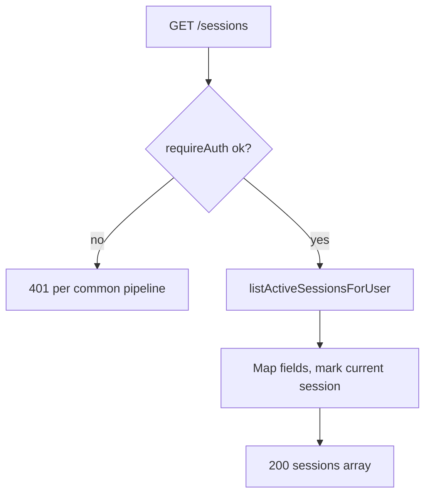
```mermaid
flowchart TD
  A["GET /sessions"] --> B{"requireAuth ok?"}
  B -->|no| B1["401 per common pipeline"]
  B -->|yes| C["listActiveSessionsForUser"]
  C --> D["Map fields, mark current session"]
  D --> E["200 sessions array"]
```

### 3.5 DELETE /api/sessions/sessions/:sessionId

Revokes one session owned by the caller.

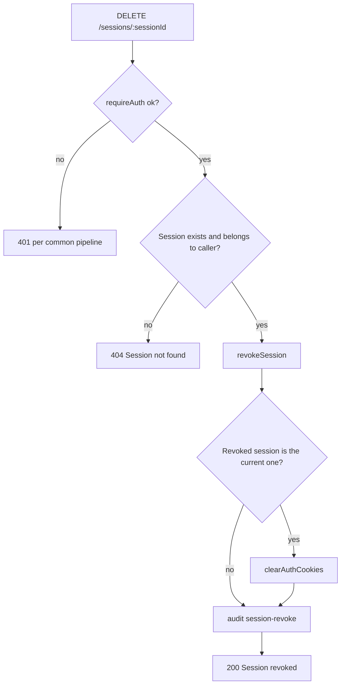
```mermaid
flowchart TD
  A["DELETE /sessions/:sessionId"] --> B{"requireAuth ok?"}
  B -->|no| B1["401 per common pipeline"]
  B -->|yes| C{"Session exists and belongs to caller?"}
  C -->|no| C1["404 Session not found"]
  C -->|yes| D["revokeSession"]
  D --> E{"Revoked session is the current one?"}
  E -->|yes| E1["clearAuthCookies"]
  E -->|no| F["audit session-revoke"]
  E1 --> F
  F --> G["200 Session revoked"]
```

### 3.6 POST /api/sessions/sessions/revoke-all

Revokes every session for the caller and clears cookies.

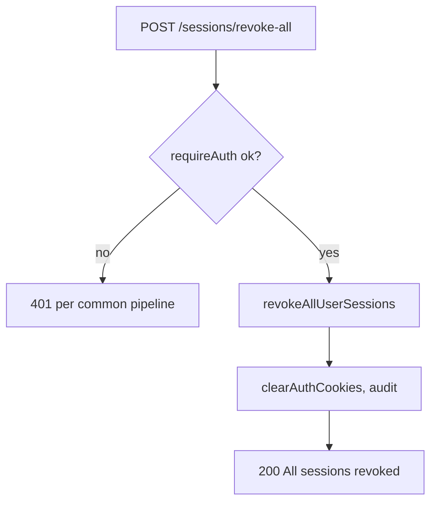
```mermaid
flowchart TD
  A["POST /sessions/revoke-all"] --> B{"requireAuth ok?"}
  B -->|no| B1["401 per common pipeline"]
  B -->|yes| C["revokeAllUserSessions"]
  C --> D["clearAuthCookies, audit"]
  D --> E["200 All sessions revoked"]
```

---

## 4. Organization Endpoints (`/api/organizations`)

Source: `backend/src/routes/organizations.routes.js`. Routes under `/current` use the organization resolved by `resolveOrganizationContext` for the signed-in user.

### 4.1 GET /api/organizations/mine

Lists the caller's organizations and the current one. Uses only `requireAuth`.

```mermaid
flowchart TD
  A["GET /mine"] --> B{"requireAuth ok?"}
  B -->|no| B1["401 per common pipeline"]
  B -->|yes| C["getUserOrganizations"]
  C --> D["Read currentOrganizationId from user"]
  D --> E["200 organizations and currentOrganizationId"]
```

### 4.2 GET /api/organizations/profiles

Returns the profile table. Owner and members with `organization.read`.

```mermaid
flowchart TD
  A["GET /profiles"] --> B{"Common pipeline ok, permission organization.read?"}
  B -->|no| B1["401, 403, or 404 per common pipeline"]
  B -->|yes| C["getProfileTable"]
  C --> D["200 profiles"]
```

### 4.3 POST /api/organizations/switch

Changes the caller's current organization. Uses only `requireAuth`.

```mermaid
flowchart TD
  A["POST /switch"] --> B{"requireAuth ok?"}
  B -->|no| B1["401 per common pipeline"]
  B -->|yes| C{"organizationId present?"}
  C -->|no| C1["400 organizationId is required"]
  C -->|yes| D{"Active membership in that organization?"}
  D -->|no| D1["403 Organization membership required"]
  D -->|yes| E{"User row updated?"}
  E -->|no| E1["404 User not found"]
  E -->|yes| F["200 Organization context updated"]
```

### 4.4 GET /api/organizations/current

Returns the current organization and membership.

```mermaid
flowchart TD
  A["GET /current"] --> B{"Common pipeline ok, permission organization.read?"}
  B -->|no| B1["401, 403, or 404 per common pipeline"]
  B -->|yes| C["200 organization and membership from req"]
```

### 4.5 GET /api/organizations/current/members

Lists active members with email and name.

```mermaid
flowchart TD
  A["GET /current/members"] --> B{"Common pipeline ok, permission organization.read?"}
  B -->|no| B1["401, 403, or 404 per common pipeline"]
  B -->|yes| C["Query active memberships for organization"]
  C --> D["Batch load users by id"]
  D --> E["Map and sort by email"]
  E --> F["200 members"]
```

### 4.6 GET /api/organizations/current/invites

Lists pending invites. Owner only.

```mermaid
flowchart TD
  A["GET /current/invites"] --> B{"Common pipeline ok, owner only organization.invite.read?"}
  B -->|no| B1["401, 403, or 404 per common pipeline"]
  B -->|yes| C["Query pending invites for organization"]
  C --> D["Map and sort newest first"]
  D --> E["200 invites"]
```

### 4.7 POST /api/organizations/current/invites

Creates an invite. Owner only. Checks seat and collaborator quotas.

```mermaid
flowchart TD
  A["POST /current/invites"] --> B{"Common pipeline ok, owner only organization.member.invite?"}
  B -->|no| B1["401, 403, or 404 per common pipeline"]
  B -->|yes| C{"billingAdmin is a valid boolean if provided?"}
  C -->|no| C1["400 billingAdmin validation error"]
  C -->|yes| D{"email present?"}
  D -->|no| D1["400 email is required"]
  D -->|yes| E{"Email format valid?"}
  E -->|no| E1["400 Invalid email address"]
  E -->|yes| F{"canAssignSeats allowed?"}
  F -->|no| F1["402 seat_limit_exceeded"]
  F -->|yes| G{"canAssignCollaborators allowed?"}
  G -->|no| G1["402 collaborator_limit_exceeded"]
  G -->|yes| H{"Already an active member with this email?"}
  H -->|yes| H1["409 User is already a member"]
  H -->|no| I{"Pending invite exists for email?"}
  I -->|yes| I1["409 Pending invite already exists"]
  I -->|no| J["Create invite with opaque token, expires in 7 days, audit"]
  J --> K["201 invite"]
```

### 4.8 POST /api/organizations/invites/accept

Accepts an invite. Uses only `requireAuth`. Creates or reactivates membership, then provisions a workspace.

```mermaid
flowchart TD
  A["POST /invites/accept"] --> B{"requireAuth ok?"}
  B -->|no| B1["401 per common pipeline"]
  B -->|yes| C{"token present?"}
  C -->|no| C1["400 Invite token is required"]
  C -->|yes| D{"Pending invite found for token?"}
  D -->|no| D1["404 Invite not found or already consumed"]
  D -->|yes| E{"Invite not expired?"}
  E -->|no| E1["400 Invite has expired"]
  E -->|yes| F{"User found?"}
  F -->|no| F1["404 User not found"]
  F -->|yes| G{"Invite email matches signed-in account?"}
  G -->|no| G1["403 Invite email does not match signed-in account"]
  G -->|yes| H{"canAssignSeats allowed when not already active?"}
  H -->|no| H1["402 seat_limit_exceeded"]
  H -->|yes| I{"canAssignCollaborators allowed when not already active?"}
  I -->|no| I1["402 collaborator_limit_exceeded"]
  I -->|yes| J["Create or reactivate membership, mark invite accepted, set currentOrganizationId"]
  J --> K{"ensureWorkspaceForUserProvisioned ok?"}
  K -->|no| K1["500 Invite accepted, but workspace provisioning failed"]
  K -->|yes| L["200 Accepted"]
```

### 4.9 PATCH /api/organizations/current/members/:membershipId

Sets `billingAdmin` for a member. Owner only.

```mermaid
flowchart TD
  A["PATCH /current/members/:membershipId"] --> B{"Common pipeline ok, owner only organization.member.manage?"}
  B -->|no| B1["401, 403, or 404 per common pipeline"]
  B -->|yes| C{"Active membership in this organization?"}
  C -->|no| C1["404 Member not found"]
  C -->|yes| D{"billingAdmin is a valid boolean if provided?"}
  D -->|no| D1["400 billingAdmin validation error"]
  D -->|yes| E{"Target is owner and caller is not owner?"}
  E -->|yes| E1["403 Only organization owner can manage owner membership"]
  E -->|no| F["Update billingAdmin, audit organization.member.update"]
  F --> G["200 member"]
```

### 4.10 DELETE /api/organizations/current/members/:membershipId

Removes a member. Owner only. Moves the removed user's current organization to another active membership if one exists.

```mermaid
flowchart TD
  A["DELETE /current/members/:membershipId"] --> B{"Common pipeline ok, owner only organization.member.manage?"}
  B -->|no| B1["401, 403, or 404 per common pipeline"]
  B -->|yes| C{"Active membership in this organization?"}
  C -->|no| C1["404 Member not found"]
  C -->|yes| D{"Target is organization owner?"}
  D -->|yes| D1["403 Owner cannot be removed"]
  D -->|no| E["Set membership status to removed, audit organization.member.remove"]
  E --> F{"Removed user's currentOrganizationId is this organization?"}
  F -->|yes| G["Set currentOrganizationId to another active org or null"]
  F -->|no| H["No change to user context"]
  G --> I["200 Member removed"]
  H --> I
```

### 4.11 GET /api/organizations/current/entitlements

Returns the entitlement snapshot for the current organization.

```mermaid
flowchart TD
  A["GET /current/entitlements"] --> B{"Common pipeline ok, permission organization.read?"}
  B -->|no| B1["401, 403, or 404 per common pipeline"]
  B -->|yes| C["getOrganizationEntitlements"]
  C --> D{"Entitlements returned?"}
  D -->|no| D1["404 Entitlements unavailable"]
  D -->|yes| E["200 entitlements"]
```

---

## 5. Enterprise Security Endpoints (`/api/organizations`)

Source: `backend/src/routes/enterprise-security.routes.js`. The router applies `requireAuth` and `resolveOrganizationContext` to every request that reaches it. Owner-only endpoints use `organization.member.manage`.

### 5.1 GET /api/organizations/current/security

Returns the organization security state.

```mermaid
flowchart TD
  A["GET /current/security"] --> B{"Common pipeline ok, permission organization.read?"}
  B -->|no| B1["401, 403, or 404 per common pipeline"]
  B -->|yes| C["getOrganizationSecurityState"]
  C --> D["200 security state"]
```

### 5.2 POST /api/organizations/current/enterprise/environment

Sets up the enterprise environment: plan, seats, optional domains, and an optional SSO provider. Owner only.

```mermaid
flowchart TD
  A["POST /current/enterprise/environment"] --> B{"Common pipeline ok, owner only organization.member.manage?"}
  B -->|no| B1["401, 403, or 404 per common pipeline"]
  B -->|yes| C{"Organization record found?"}
  C -->|no| C1["404 Organization not found"]
  C -->|yes| D["Set planId enterprise, seats, domains, optional SSO provider"]
  D --> E["Mark active members isSubscribed, update security state"]
  E --> F["201 environment result"]
```

### 5.3 PUT /api/organizations/current/security/policies

Updates organization security policies. Owner only.

```mermaid
flowchart TD
  A["PUT /current/security/policies"] --> B{"Common pipeline ok, owner only organization.member.manage?"}
  B -->|no| B1["401, 403, or 404 per common pipeline"]
  B -->|yes| C["updateOrganizationSecurityState with new policies"]
  C --> D["Audit, 200 updated security state"]
```

### 5.4 PUT /api/organizations/current/security/domains

Updates allowed email domains mapped to the organization. Owner only.

```mermaid
flowchart TD
  A["PUT /current/security/domains"] --> B{"Common pipeline ok, owner only organization.member.manage?"}
  B -->|no| B1["401, 403, or 404 per common pipeline"]
  B -->|yes| C["updateOrganizationSecurityState with new domains"]
  C --> D["Audit, 200 updated security state"]
```

### 5.5 POST /api/organizations/current/security/sso/providers

Adds an SSO provider. Owner only.

```mermaid
flowchart TD
  A["POST /current/security/sso/providers"] --> B{"Common pipeline ok, owner only organization.member.manage?"}
  B -->|no| B1["401, 403, or 404 per common pipeline"]
  B -->|yes| C{"Provider name present?"}
  C -->|no| C1["400 Provider name is required"]
  C -->|yes| D["await updateOrganizationSecurityState, append provider"]
  D --> E["Audit organization.security.sso-provider.create"]
  E --> F["201 sanitized provider"]
```

### 5.6 PATCH /api/organizations/current/security/sso/providers/:providerId

Updates an SSO provider. Owner only.

```mermaid
flowchart TD
  A["PATCH /current/security/sso/providers/:providerId"] --> B{"Common pipeline ok, owner only organization.member.manage?"}
  B -->|no| B1["401, 403, or 404 per common pipeline"]
  B -->|yes| C{"Provider exists?"}
  C -->|no| C1["404 SSO provider not found"]
  C -->|yes| D["Update provider fields and save security state"]
  D --> E["200 updated provider"]
```

### 5.7 DELETE /api/organizations/current/security/sso/providers/:providerId

Removes an SSO provider. Owner only.

```mermaid
flowchart TD
  A["DELETE /current/security/sso/providers/:providerId"] --> B{"Common pipeline ok, owner only organization.member.manage?"}
  B -->|no| B1["401, 403, or 404 per common pipeline"]
  B -->|yes| C{"Provider exists?"}
  C -->|no| C1["404 SSO provider not found"]
  C -->|yes| D["Remove provider and save security state"]
  D --> E["200 removed"]
```

### 5.8 POST /api/organizations/sso/simulate-login

Simulates SSO routing for an email. Checks domain mapping and that an active provider exists. Does not create a session.

```mermaid
flowchart TD
  A["POST /sso/simulate-login"] --> B{"Common pipeline ok, permission organization.read?"}
  B -->|no| B1["401, 403, or 404 per common pipeline"]
  B -->|yes| C{"Valid email with @ present?"}
  C -->|no| C1["400 Valid email is required"]
  C -->|yes| D{"Organization domain mapping found for email domain?"}
  D -->|no| D1["404 No organization domain mapping found"]
  D -->|yes| E{"Enabled SSO provider configured?"}
  E -->|no| E1["400 No active SSO provider configured"]
  E -->|yes| F["200 Simulated routing result"]
```

### 5.9 POST /api/organizations/current/security/ldap/import-users

Imports users from an LDAP provider. Owner only. Checks seat and collaborator quotas per row. Failed rows are reported, not fatal.

```mermaid
flowchart TD
  A["POST /current/security/ldap/import-users"] --> B{"Common pipeline ok, owner only organization.member.manage?"}
  B -->|no| B1["401, 403, or 404 per common pipeline"]
  B -->|yes| C{"Enabled LDAP provider configured?"}
  C -->|no| C1["400 No enabled LDAP provider configured"]
  C -->|yes| D{"providerId matches an enabled LDAP provider?"}
  D -->|no| D1["404 LDAP provider not found or disabled"]
  D -->|yes| E{"users array has at least one row?"}
  E -->|no| E1["400 users array is required"]
  E -->|yes| F["For each row: validate email"]
  F -->|invalid| F1["Add to failed list, Invalid email format"]
  F -->|valid| G{"Needs seat, canAssignSeats allowed?"}
  G -->|no| G1["Add to failed list, seat_limit_exceeded"]
  G -->|yes| H{"Needs membership, canAssignCollaborators allowed?"}
  H -->|no| H1["Add to failed list, collaborator_limit_exceeded"]
  H -->|yes| I["Create user if missing, create or activate membership"]
  I --> J{"Row handled, more rows?"}
  F1 --> J
  G1 --> J
  H1 --> J
  J -->|yes| F
  J -->|no| K["200 imported, skipped, failed summary"]
```

### 5.10 GET /api/organizations/current/audit-logs

Lists organization audit log entries. Requires `organization.read`.

```mermaid
flowchart TD
  A["GET /current/audit-logs"] --> B{"Common pipeline ok, permission organization.read?"}
  B -->|no| B1["401, 403, or 404 per common pipeline"]
  B -->|yes| C["Query audit logs for organization"]
  C --> D["200 logs"]
```

### 5.11 GET /api/organizations/current/audit-logs/export.csv

Exports organization audit logs as CSV and writes an audit entry for the export.

```mermaid
flowchart TD
  A["GET /current/audit-logs/export.csv"] --> B{"Common pipeline ok, permission organization.read?"}
  B -->|no| B1["401, 403, or 404 per common pipeline"]
  B -->|yes| C["Query audit logs for organization"]
  C --> D["Build CSV"]
  D --> E["Write audit entry for export"]
  E --> F["200 text/csv"]
```

---

## 6. Billing Endpoints (`/api/billing`)

Source: `backend/src/routes/billing.routes.js`. Every billing endpoint forwards the request to the external billing service through `requestBillingService`. If the service call fails, the endpoint returns `502 billing_service_unavailable`. The local backend does not process billing events itself.

### 6.1 GET /api/billing/plans

Returns plans from the billing service.

```mermaid
flowchart TD
  A["GET /plans"] --> B{"Common pipeline ok, permission organization.read?"}
  B -->|no| B1["401, 403, or 404 per common pipeline"]
  B -->|yes| C["Forward to billing service"]
  C -->|failure| C1["502 billing_service_unavailable"]
  C -->|ok| D["200 plans"]
```

### 6.2 GET /api/billing/current

Returns the current billing record and attaches entitlements.

```mermaid
flowchart TD
  A["GET /current"] --> B{"Common pipeline ok, permission organization.read?"}
  B -->|no| B1["401, 403, or 404 per common pipeline"]
  B -->|yes| C["attachEntitlements"]
  C -->|suspended| C1["402 subscription_suspended"]
  C -->|ok| D["Forward to billing service"]
  D -->|failure| D1["502 billing_service_unavailable"]
  D -->|ok| E["200 billing record with entitlements"]
```

### 6.3 GET /api/billing/invoices

Returns invoices from the billing service.

```mermaid
flowchart TD
  A["GET /invoices"] --> B{"Common pipeline ok, permission organization.read?"}
  B -->|no| B1["401, 403, or 404 per common pipeline"]
  B -->|yes| C["Forward to billing service"]
  C -->|failure| C1["502 billing_service_unavailable"]
  C -->|ok| D["200 invoices"]
```

### 6.4 POST /api/billing/checkout

Starts a checkout session. Requires `organization.billing.manage`.

```mermaid
flowchart TD
  A["POST /checkout"] --> B{"Common pipeline ok, organization.billing.manage owner or billingAdmin?"}
  B -->|no| B1["401, 403, or 404 per common pipeline"]
  B -->|yes| C["Forward to billing service"]
  C -->|failure| C1["502 billing_service_unavailable"]
  C -->|ok| D["200 checkout result from billing service"]
```

### 6.5 POST /api/billing/subscription/change

Changes the subscription plan. Requires `organization.billing.manage`.

```mermaid
flowchart TD
  A["POST /subscription/change"] --> B{"Common pipeline ok, organization.billing.manage?"}
  B -->|no| B1["401, 403, or 404 per common pipeline"]
  B -->|yes| C["Forward to billing service"]
  C -->|failure| C1["502 billing_service_unavailable"]
  C -->|ok| D["200 result from billing service"]
```

### 6.6 PATCH /api/billing/seats

Updates the seat count. Requires `organization.billing.manage`.

```mermaid
flowchart TD
  A["PATCH /seats"] --> B{"Common pipeline ok, organization.billing.manage?"}
  B -->|no| B1["401, 403, or 404 per common pipeline"]
  B -->|yes| C["Forward to billing service"]
  C -->|failure| C1["502 billing_service_unavailable"]
  C -->|ok| D["200 result from billing service"]
```

### 6.7 GET /api/billing/webhooks/jobs

Lists webhook processing jobs for the organization. Requires `organization.billing.manage`.

```mermaid
flowchart TD
  A["GET /webhooks/jobs"] --> B{"Common pipeline ok, organization.billing.manage?"}
  B -->|no| B1["401, 403, or 404 per common pipeline"]
  B -->|yes| C["Forward to billing service"]
  C -->|failure| C1["502 billing_service_unavailable"]
  C -->|ok| D["200 jobs"]
```

### 6.8 POST /api/billing/webhooks/provider

Provider callback endpoint. Public, with no `requireAuth`. Source: `backend/src/routes/billing-webhooks.routes.js`. Forwards the request body to the billing service, which handles processing.

```mermaid
flowchart TD
  A["POST /api/billing/webhooks/provider"] --> B["Forward body to billing service /api/billing/webhooks/provider"]
  B -->|failure| B1["502 billing_service_unavailable"]
  B -->|ok| C["Pass through billing service response"]
```

---

## 7. Document Endpoints (`/api/docs`)

Source: `backend/src/routes/docs.routes.js`. Quota checks use the store helpers in `backend/src/store/index.js`.

### 7.1 POST /api/docs

Creates a document. Checks the document count quota and the storage quota.

```mermaid
flowchart TD
  A["POST /api/docs"] --> B{"Common pipeline ok, permission document.create, attachEntitlements?"}
  B -->|no| B1["401, 403, 402, or 404 per common pipeline"]
  B -->|yes| C{"Workspace resolves for organization?"}
  C -->|no| C1["400 workspace error"]
  C -->|yes| D{"canCreateDocuments allowed?"}
  D -->|no| D1["402 document_limit_exceeded"]
  D -->|yes| E{"Organization entitlements loaded?"}
  E -->|no| E1["404 Organization entitlements unavailable"]
  E -->|yes| F{"Storage projection within limit?"}
  F -->|no| F1["402 storage_quota_exceeded"]
  F -->|yes| G["Create document, audit document.create"]
  G --> H["201 doc"]
```

### 7.2 GET /api/docs

Lists documents for the organization. Audited as `document.list`.

```mermaid
flowchart TD
  A["GET /api/docs"] --> B{"Common pipeline ok, permission document.read?"}
  B -->|no| B1["401, 403, or 404 per common pipeline"]
  B -->|yes| C["Query documents where organizationId equals org"]
  C --> D["Audit document.list"]
  D --> E["200 docs"]
```

### 7.3 GET /api/docs/:id

Returns one document.

```mermaid
flowchart TD
  A["GET /api/docs/:id"] --> B{"Common pipeline ok, permission document.read?"}
  B -->|no| B1["401, 403, or 404 per common pipeline"]
  B -->|yes| C{"Document exists in this organization?"}
  C -->|no| C1["404 Document not found"]
  C -->|yes| D["200 doc"]
```

### 7.4 PUT /api/docs/:id

Updates a document. Checks the update quota and storage projection, then counts the update.

```mermaid
flowchart TD
  A["PUT /api/docs/:id"] --> B{"Common pipeline ok, permission document.update, attachEntitlements?"}
  B -->|no| B1["401, 403, or 404 per common pipeline"]
  B -->|yes| C{"Document exists in this organization?"}
  C -->|no| C1["404 Document not found"]
  C -->|yes| D{"Workspace resolves for organization?"}
  D -->|no| D1["400 workspace error"]
  D -->|yes| E{"canUpdateDocuments allowed?"}
  E -->|no| E1["402 document_update_limit_exceeded"]
  E -->|yes| F{"Organization entitlements loaded?"}
  F -->|no| F1["404 Organization entitlements unavailable"]
  F -->|yes| G{"Storage projection within limit?"}
  G -->|no| G1["402 storage_quota_exceeded"]
  G -->|yes| H["Update document"]
  H --> I["consumeDocumentUpdates count 1"]
  I --> J["200 updated doc"]
```

### 7.5 DELETE /api/docs/:id

Deletes a document and audits the action. The handler does not run quota checks.

```mermaid
flowchart TD
  A["DELETE /api/docs/:id"] --> B{"Common pipeline ok, permission document.delete, attachEntitlements?"}
  B -->|no| B1["401, 403, or 404 per common pipeline"]
  B -->|yes| C{"Document exists in this organization?"}
  C -->|no| C1["404 Document not found"]
  C -->|yes| D["Delete document, audit document.delete"]
  D --> E["200 deleted"]
```

---

## 8. Document-Scoped Resources (`/api/docs/:docId/...`)

All routes in this section are mounted with `mergeParams` in `app.js`. They first confirm the document belongs to the caller's organization.

### 8.1 GET /api/docs/:docId/comments

Lists comments for a document.

```mermaid
flowchart TD
  A["GET /api/docs/:docId/comments"] --> B{"Common pipeline ok, permission document.comment.read?"}
  B -->|no| B1["401, 403, or 404 per common pipeline"]
  B -->|yes| C{"Document exists?"}
  C -->|no| C1["404 Document not found"]
  C -->|yes| D{"Document belongs to organization?"}
  D -->|no| D1["403 Access denied"]
  D -->|yes| E["200 comments ordered by createdAt"]
```

### 8.2 POST /api/docs/:docId/comments

Adds a comment.

```mermaid
flowchart TD
  A["POST /api/docs/:docId/comments"] --> B{"Common pipeline ok, permission document.comment.write?"}
  B -->|no| B1["401, 403, or 404 per common pipeline"]
  B -->|yes| C{"Document exists?"}
  C -->|no| C1["404 Document not found"]
  C -->|yes| D{"Document belongs to organization?"}
  D -->|no| D1["403 Access denied"]
  D -->|yes| E{"text present and non-blank?"}
  E -->|no| E1["400 text is required"]
  E -->|yes| F["Create comment with userId"]
  F --> G["201 comment"]
```

### 8.3 DELETE /api/docs/:docId/comments/:commentId

Deletes a comment on the document.

```mermaid
flowchart TD
  A["DELETE /api/docs/:docId/comments/:commentId"] --> B{"Common pipeline ok, permission document.comment.delete?"}
  B -->|no| B1["401, 403, or 404 per common pipeline"]
  B -->|yes| C{"Document exists and belongs to organization?"}
  C -->|no| C1["404 or 403 per document check"]
  C -->|yes| D{"deleteMany removed a row for this comment and doc?"}
  D -->|no| D1["404 Comment not found"]
  D -->|yes| E["200 Comment deleted"]
```

### 8.4 GET /api/docs/:docId/versions

Lists retained versions, newest first. Filters by the organization's version retention window.

```mermaid
flowchart TD
  A["GET /api/docs/:docId/versions"] --> B{"Common pipeline ok, permission document.version.read?"}
  B -->|no| B1["401, 403, or 404 per common pipeline"]
  B -->|yes| C{"Document exists and belongs to organization?"}
  C -->|no| C1["404 or 403 per document check"]
  C -->|yes| D["getVersionHistoryRetentionDays"]
  D --> E["Load versions newest first"]
  E --> F["filterVersionsByRetention"]
  F --> G["200 versions with preview and savedAt"]
```

### 8.5 POST /api/docs/:docId/versions

Saves a snapshot. Keeps only the 20 newest versions per document.

```mermaid
flowchart TD
  A["POST /api/docs/:docId/versions"] --> B{"Common pipeline ok, permission document.version.write?"}
  B -->|no| B1["401, 403, or 404 per common pipeline"]
  B -->|yes| C{"Document exists and belongs to organization?"}
  C -->|no| C1["404 or 403 per document check"]
  C -->|yes| D{"content is a string?"}
  D -->|no| D1["400 content is required"]
  D -->|yes| E["Create version with derived preview"]
  E --> F["Find versions beyond the 20 newest and delete them"]
  F --> G["201 version"]
```

### 8.6 POST /api/docs/:docId/versions/:versionId/restore

Overwrites the document content with a retained version.

```mermaid
flowchart TD
  A["POST /versions/:versionId/restore"] --> B{"Common pipeline ok, permission document.version.restore?"}
  B -->|no| B1["401, 403, or 404 per common pipeline"]
  B -->|yes| C{"Document exists and belongs to organization?"}
  C -->|no| C1["404 or 403 per document check"]
  C -->|yes| D{"Version exists for this document?"}
  D -->|no| D1["404 Version not found"]
  D -->|yes| E{"Version within retention window?"}
  E -->|no| E1["404 Version not found"]
  E -->|yes| F["Update document content from version"]
  F --> G["200 updated doc"]
```

### 8.7 DELETE /api/docs/:docId/versions/:versionId

Deletes one retained version.

```mermaid
flowchart TD
  A["DELETE /versions/:versionId"] --> B{"Common pipeline ok, permission document.version.delete?"}
  B -->|no| B1["401, 403, or 404 per common pipeline"]
  B -->|yes| C{"Document exists and belongs to organization?"}
  C -->|no| C1["404 or 403 per document check"]
  C -->|yes| D{"Version exists for this document?"}
  D -->|no| D1["404 Version not found"]
  D -->|yes| E{"Version within retention window?"}
  E -->|no| E1["404 Version not found"]
  E -->|yes| F["Delete version"]
  F --> G["200 Version deleted"]
```

### 8.8 GET /api/docs/:docId/todos

Returns the todo list for the document. Todos are stored in the `todos` table using organization scope and a doc-scoped storage key.

```mermaid
flowchart TD
  A["GET /api/docs/:docId/todos"] --> B{"Common pipeline ok, permission document.todo.read?"}
  B -->|no| B1["401, 403, or 404 per common pipeline"]
  B -->|yes| C{"getDoc finds document in organization?"}
  C -->|no| C1["404 or 403 per document check"]
  C -->|yes| D["Query todos table by org + doc scope, normalize list"]
  D --> E["200 todos"]
```

### 8.9 POST /api/docs/:docId/todos

Adds a todo item.

```mermaid
flowchart TD
  A["POST /api/docs/:docId/todos"] --> B{"Common pipeline ok, permission document.todo.write?"}
  B -->|no| B1["401, 403, or 404 per common pipeline"]
  B -->|yes| C{"getDoc finds document in organization?"}
  C -->|no| C1["404 or 403 per document check"]
  C -->|yes| D{"text present and non-blank?"}
  D -->|no| D1["400 text is required"]
  D -->|yes| E["Insert todo row with new uuid"]
  E --> F["201 todo"]
```

### 8.10 PUT /api/docs/:docId/todos/:todoId

Updates a todo's `done` flag or text.

```mermaid
flowchart TD
  A["PUT /api/docs/:docId/todos/:todoId"] --> B{"Common pipeline ok, permission document.todo.write?"}
  B -->|no| B1["401, 403, or 404 per common pipeline"]
  B -->|yes| C{"getDoc finds document in organization?"}
  C -->|no| C1["404 or 403 per document check"]
  C -->|yes| D{"Todo found in list?"}
  D -->|no| D1["404 Todo not found"]
  D -->|yes| E["Apply done and text changes, upsert list"]
  E --> F["200 todo"]
```

### 8.11 DELETE /api/docs/:docId/todos/:todoId

Removes a todo item.

```mermaid
flowchart TD
  A["DELETE /api/docs/:docId/todos/:todoId"] --> B{"Common pipeline ok, permission document.todo.delete?"}
  B -->|no| B1["401, 403, or 404 per common pipeline"]
  B -->|yes| C{"getDoc finds document in organization?"}
  C -->|no| C1["404 or 403 per document check"]
  C -->|yes| D{"Todo found in list?"}
  D -->|no| D1["404 Todo not found"]
  D -->|yes| E["Splice todo, upsert list"]
  E --> F["200 Todo deleted"]
```

---

## 9. Workspace Endpoints (`/api/workspaces`)

Source: `backend/src/routes/workspaces.routes.js`.

### 9.1 GET /api/workspaces

Lists workspaces the caller can see. Provisions the caller's default workspace first.

```mermaid
flowchart TD
  A["GET /api/workspaces"] --> B{"Common pipeline ok, permission workspace.read?"}
  B -->|no| B1["401, 403, or 404 per common pipeline"]
  B -->|yes| C{"ensureWorkspaceForUserProvisioned ok?"}
  C -->|no| C1["500 Failed to initialize workspace"]
  C -->|yes| D["Query workspaces for organization or personal user id"]
  D --> E["Filter by isWorkspaceVisibleToUser and sort"]
  E --> F["200 workspaces"]
```

### 9.2 POST /api/workspaces

Creates a workspace. Only available on paid plans.

```mermaid
flowchart TD
  A["POST /api/workspaces"] --> B{"Common pipeline ok, permission workspace.create, attachEntitlements?"}
  B -->|no| B1["401, 403, or 404 per common pipeline"]
  B -->|yes| C{"Plan is free?"}
  C -->|yes| C1["402 workspace_creation_requires_paid_plan"]
  C -->|no| D["Use name or New Workspace"]
  D --> E{"prisma workspace create ok?"}
  E -->|no| E1["500 Failed to create workspace"]
  E -->|yes| F["201 workspace"]
```

---

## 10. Template Endpoint (`/api/templates`)

Source: `backend/src/routes/templates.routes.js`.

### 10.1 GET /api/templates

Returns templates. Uses a cache when available, falls back to the built-in list when there is no database or the query fails.

```mermaid
flowchart TD
  A["GET /api/templates"] --> B{"Common pipeline ok, permission document.read?"}
  B -->|no| B1["401, 403, or 404 per common pipeline"]
  B -->|yes| C{"DATABASE_URL set?"}
  C -->|no| C1["200 built-in templates"]
  C -->|yes| D{"Template cache populated?"}
  D -->|yes| D1["200 cached templates"]
  D -->|no| E{"Prisma template query ok?"}
  E -->|no| E1["200 built-in templates, error swallowed"]
  E -->|yes| F["Write cache"]
  F --> G["200 database templates"]
```

---

## 11. AI and Grammar Endpoints

### 11.1 POST /api/ai/chat

Chat endpoint. Currently returns a placeholder reply. Checks the AI request quota and consumes one request before the handler runs.

Source: `backend/src/routes/ai.routes.js`, `backend/src/middleware/ai/entitlements.js`.

```mermaid
flowchart TD
  A["POST /api/ai/chat"] --> B{"Common pipeline ok, permission ai.use, attachEntitlements?"}
  B -->|no| B1["401, 403, or 404 per common pipeline"]
  B -->|yes| C{"canConsumeAiRequests allowed?"}
  C -->|no| C1["402 ai_quota_exceeded"]
  C -->|yes| D{"consumeAiRequests allowed?"}
  D -->|no| D1["402 ai_quota_exceeded"]
  D -->|yes| E{"message present and non-blank?"}
  E -->|no| E1["400 message is required"]
  E -->|yes| F["Return placeholder reply"]
  F --> G["200 response"]
```

Note: the quota check and the consume step are separate calls, so concurrent requests can pass the check together.

### 11.2 POST /api/grammar/check

Grammar check. Currently rule-based placeholder checks. Requires grammar access.

Source: `backend/src/routes/grammar.routes.js`, `backend/src/middleware/grammar/entitlements.js`.

```mermaid
flowchart TD
  A["POST /api/grammar/check"] --> B{"Common pipeline ok, permission grammar.use, attachEntitlements?"}
  B -->|no| B1["401, 403, or 404 per common pipeline"]
  B -->|yes| C{"canUseGrammar allowed?"}
  C -->|no| C1["402 grammar_access_expired"]
  C -->|yes| D{"text present and non-blank?"}
  D -->|no| D1["400 text is required"]
  D -->|yes| E["Run placeholder rule checks"]
  E --> F["200 issues array"]
```

### 11.3 GET /

Health check, mounted at the root. No auth.

```mermaid
flowchart TD
  A["GET /"] --> B["200 DocSync backend running"]
```

---

## 12. Endpoint Coverage

| # | Method | Path | Auth and permission | Entitlement or quota | Source file |
|---|---|---|---|---|---|
| 1 | GET | / | none | none | health.routes.js |
| 2 | POST | /api/auth/register | rate limit only | none | auth.routes.js |
| 3 | POST | /api/auth/login | rate limit only | org IP policy, MFA policy | auth.routes.js |
| 4 | POST | /api/auth/verify-email | rate limit only | none | auth.routes.js |
| 5 | POST | /api/auth/resend-verification | rate limit only | none | auth.routes.js |
| 6 | POST | /api/auth/forgot-password | rate limit only | none | auth.routes.js |
| 7 | POST | /api/auth/reset-password | rate limit only | none | auth.routes.js |
| 8 | POST | /api/auth/login/2fa | rate limit only | org IP policy | security.routes.js |
| 9 | GET | /api/auth/public-key | rate limit only | none | security.routes.js |
| 10 | GET | /api/auth/audit-logs | requireAuth | none | security.routes.js |
| 11 | GET | /api/auth/security | requireAuth | none | security.routes.js |
| 12 | POST | /api/auth/2fa/setup | requireAuth | none | security.routes.js |
| 13 | POST | /api/auth/2fa/enable | requireAuth | none | security.routes.js |
| 14 | POST | /api/auth/2fa/disable | requireAuth | none | security.routes.js |
| 15 | POST | /api/auth/refresh | rate limit, CSRF | org IP policy | sessions.routes.js |
| 16 | POST | /api/auth/logout | requireAuth | none | sessions.routes.js |
| 17 | GET | /api/auth/me | requireAuth | none | sessions.routes.js |
| 18 | GET | /api/auth/sessions | requireAuth | none | sessions.routes.js |
| 19 | DELETE | /api/auth/sessions/:sessionId | requireAuth | none | sessions.routes.js |
| 20 | POST | /api/auth/sessions/revoke-all | requireAuth | none | sessions.routes.js |
| 21 | POST | /api/sessions/refresh | rate limit, CSRF | org IP policy | sessions.routes.js |
| 22 | POST | /api/sessions/logout | requireAuth | none | sessions.routes.js |
| 23 | GET | /api/sessions/me | requireAuth | none | sessions.routes.js |
| 24 | GET | /api/sessions/sessions | requireAuth | none | sessions.routes.js |
| 25 | DELETE | /api/sessions/sessions/:sessionId | requireAuth | none | sessions.routes.js |
| 26 | POST | /api/sessions/sessions/revoke-all | requireAuth | none | sessions.routes.js |
| 27 | POST | /api/security/login/2fa | rate limit only | org IP policy | security.routes.js |
| 28 | GET | /api/security/public-key | rate limit only | none | security.routes.js |
| 29 | GET | /api/security/audit-logs | requireAuth | none | security.routes.js |
| 30 | GET | /api/security/security | requireAuth | none | security.routes.js |
| 31 | POST | /api/security/2fa/setup | requireAuth | none | security.routes.js |
| 32 | POST | /api/security/2fa/enable | requireAuth | none | security.routes.js |
| 33 | POST | /api/security/2fa/disable | requireAuth | none | security.routes.js |
| 34 | GET | /api/organizations/mine | requireAuth | none | organizations.routes.js |
| 35 | GET | /api/organizations/profiles | organization.read | none | organizations.routes.js |
| 36 | POST | /api/organizations/switch | requireAuth, membership check | none | organizations.routes.js |
| 37 | GET | /api/organizations/current | organization.read | none | organizations.routes.js |
| 38 | GET | /api/organizations/current/members | organization.read | none | organizations.routes.js |
| 39 | GET | /api/organizations/current/invites | owner only | none | organizations.routes.js |
| 40 | POST | /api/organizations/current/invites | owner only | seat and collaborator quota | organizations.routes.js |
| 41 | POST | /api/organizations/invites/accept | requireAuth, email match | seat and collaborator quota | organizations.routes.js |
| 42 | PATCH | /api/organizations/current/members/:membershipId | owner only | none | organizations.routes.js |
| 43 | DELETE | /api/organizations/current/members/:membershipId | owner only | none | organizations.routes.js |
| 44 | GET | /api/organizations/current/entitlements | organization.read | entitlements read | organizations.routes.js |
| 45 | GET | /api/organizations/current/security | organization.read | none | enterprise-security.routes.js |
| 46 | POST | /api/organizations/current/enterprise/environment | owner only | none | enterprise-security.routes.js |
| 47 | PUT | /api/organizations/current/security/policies | owner only | none | enterprise-security.routes.js |
| 48 | PUT | /api/organizations/current/security/domains | owner only | none | enterprise-security.routes.js |
| 49 | POST | /api/organizations/current/security/sso/providers | owner only | none | enterprise-security.routes.js |
| 50 | PATCH | /api/organizations/current/security/sso/providers/:providerId | owner only | none | enterprise-security.routes.js |
| 51 | DELETE | /api/organizations/current/security/sso/providers/:providerId | owner only | none | enterprise-security.routes.js |
| 52 | POST | /api/organizations/sso/simulate-login | organization.read | none | enterprise-security.routes.js |
| 53 | POST | /api/organizations/current/security/ldap/import-users | owner only | seat and collaborator quota | enterprise-security.routes.js |
| 54 | GET | /api/organizations/current/audit-logs | organization.read | none | enterprise-security.routes.js |
| 55 | GET | /api/organizations/current/audit-logs/export.csv | organization.read | none | enterprise-security.routes.js |
| 56 | GET | /api/billing/plans | organization.read | billing service | billing.routes.js |
| 57 | GET | /api/billing/current | organization.read | attachEntitlements | billing.routes.js |
| 58 | GET | /api/billing/invoices | organization.read | billing service | billing.routes.js |
| 59 | POST | /api/billing/checkout | organization.billing.manage | billing service | billing.routes.js |
| 60 | POST | /api/billing/subscription/change | organization.billing.manage | billing service | billing.routes.js |
| 61 | PATCH | /api/billing/seats | organization.billing.manage | billing service | billing.routes.js |
| 62 | GET | /api/billing/webhooks/jobs | organization.billing.manage | billing service | billing.routes.js |
| 63 | POST | /api/billing/webhooks/provider | none, public | billing service | billing-webhooks.routes.js |
| 64 | POST | /api/docs | document.create | document and storage quota | docs.routes.js |
| 65 | GET | /api/docs | document.read | none | docs.routes.js |
| 66 | GET | /api/docs/:id | document.read | none | docs.routes.js |
| 67 | PUT | /api/docs/:id | document.update | update and storage quota | docs.routes.js |
| 68 | DELETE | /api/docs/:id | document.delete | none in handler | docs.routes.js |
| 69 | GET | /api/docs/:docId/comments | document.comment.read | none | comments.routes.js |
| 70 | POST | /api/docs/:docId/comments | document.comment.write | none | comments.routes.js |
| 71 | DELETE | /api/docs/:docId/comments/:commentId | document.comment.delete | none | comments.routes.js |
| 72 | GET | /api/docs/:docId/versions | document.version.read | version retention | versions.routes.js |
| 73 | POST | /api/docs/:docId/versions | document.version.write | keeps 20 newest | versions.routes.js |
| 74 | POST | /api/docs/:docId/versions/:versionId/restore | document.version.restore | version retention | versions.routes.js |
| 75 | DELETE | /api/docs/:docId/versions/:versionId | document.version.delete | version retention | versions.routes.js |
| 76 | GET | /api/docs/:docId/todos | document.todo.read | none | todos.routes.js |
| 77 | POST | /api/docs/:docId/todos | document.todo.write | none | todos.routes.js |
| 78 | PUT | /api/docs/:docId/todos/:todoId | document.todo.write | none | todos.routes.js |
| 79 | DELETE | /api/docs/:docId/todos/:todoId | document.todo.delete | none | todos.routes.js |
| 80 | GET | /api/workspaces | workspace.read | none | workspaces.routes.js |
| 81 | POST | /api/workspaces | workspace.create | paid plan required | workspaces.routes.js |
| 82 | GET | /api/templates | document.read | none | templates.routes.js |
| 83 | POST | /api/ai/chat | ai.use | AI request quota | ai.routes.js |
| 84 | POST | /api/grammar/check | grammar.use | grammar access | grammar.routes.js |

Note: rows 8 to 14 and rows 27 to 33 are the same handlers from `security.routes.js`, mounted at `/api/auth` and `/api/security`. Rows 15 to 20 and rows 21 to 26 are the same handlers from `sessions.routes.js`, mounted at `/api/auth` and `/api/sessions`. Each handler is documented once in the sections above.

---

## 13. Observations

Items verified against source while building these diagrams.

### 13.1 Fixed in this change

These were missing `await` calls on async functions. Each one changed behavior, so they were fixed with a one-word edit.

- `POST /api/auth/refresh` and `POST /api/sessions/refresh` (`sessions.routes.js`): `isOrgIpAllowedForUser` is async, but the result was checked without `await`. A Promise is always truthy, so the IP allowlist was never enforced on session refresh. Fixed by adding `await`.
- `POST /api/auth/login/2fa` and `POST /api/security/login/2fa` (`security.routes.js`): same issue for the org IP allowlist on the 2FA login step. Fixed by adding `await`.
- `POST /api/organizations/current/security/sso/providers` (`enterprise-security.routes.js`): `updateOrganizationSecurityState` was not awaited, then `security.ssoProviders.find` ran on a Promise. This would throw and leave the request without a response. Fixed by adding `await`.

### 13.2 Open items

- `POST /api/auth/resend-verification` returns `404 User not found` for unknown emails and `400 Email already verified` for verified ones. This lets an attacker check which emails are registered. `forgot-password` avoids this by always returning the same message.
- Both `resend-verification` and `forgot-password` return the raw token and link in the response when `devMode` is on. Confirm `devMode` is off in production.
- `POST /api/organizations/invites/accept` creates the membership before `ensureWorkspaceForUserProvisioned`. If provisioning fails, the response is 500, but the membership and invite changes are already committed and not rolled back.
- `POST /api/docs` runs the storage check before the write but is not atomic. Concurrent creates can exceed the storage quota.
- `POST /api/ai/chat` checks the quota with `canConsumeAiRequests` and then consumes with `consumeAiRequests`. The two calls are not atomic, so concurrent requests can pass the check together.
- `POST /api/ai/chat` consumes a quota unit before the handler validates `message`. A request with an empty message still uses one AI request.
- `POST /api/organizations/current/enterprise/environment` sets the plan, seats, and `isSubscribed` on members directly in local state. Billing is external, so confirm this cannot grant entitlements without a billing-service record.
- `DELETE /api/docs/:id` loads entitlements but does not check any quota, so the entitlement middleware has no effect on that route.
- `resolveWorkspaceForOrganization` in `docs.routes.js` accepts a workspace whose `organizationId` equals the user id. This is the personal-workspace fallback. Confirm this is intended.
- The `/api/grammar/check` and `/api/ai/chat` handlers are placeholders. Their flows will change when a real provider is connected.
